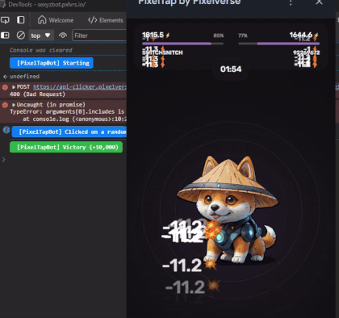

> [!NOTE]
> - Контакты: [Telegram](https://t.me/mudachyo) 
> - Канал: [Telegram Channel](https://t.me/shopalenka) 
> - 🇪🇳 README in english available [here](README-EN.md)




---
# How to run
# [View video instruction](https://www.youtube.com/watch?v=FgyCcPZBmtc)
### Telegram Desktop на Windows, Linux and macOS
1. Download and launch the latest version of Telegram Desktop on **Windows**, **Linux** or **macOS**.
2. Go to *Settings* > *Advanced* > *Experimental settings* > *Enable webview inspection*.
3. Open **[PixelTap](tg://resolve?domain=pixelversexyzbot&start=2475526)**
4. Right click anywhere in the game and select the last option *Inspect*
5. Open ‘Console’, paste the code in there and start the fight. (Disable paste protection - https://stackoverflow.com/a/78472510)

### Telegram macOS
1. Download and run [Telegram Beta](https://telegram.org/dl/macos/beta) for **macOS**.
2. Quickly click 5 times on the *Settings* icon to open the debug menu and enable “Debug Mini Apps”.

### The script itself:
```javascript
const styles = {
    success: 'background: #28a745; color: #ffffff; font-weight: bold; padding: 4px 8px; border-radius: 4px;',
	starting: 'background: #8640ff; color: #ffffff; font-weight: bold; padding: 4px 8px; border-radius: 4px;',
    error: 'background: #dc3545; color: #ffffff; font-weight: bold; padding: 4px 8px; border-radius: 4px;',
    info: 'background: #007bff; color: #ffffff; font-weight: bold; padding: 4px 8px; border-radius: 4px;'
};
const logPrefix = '%c [PixelTapBot] ';

const originalLog = console.log;
console.log = function () {
    if (arguments[0].includes('[PixelTapBot]')) {
        originalLog.apply(console, arguments);
    }
};

console.error = console.warn = console.info = console.debug = function () { };

console.clear();
console.log(`${logPrefix}Starting`, styles.starting);
console.log(`${logPrefix}Create by t.me/mudachyo`, styles.starting);

function createEvent(type, target, options) {
    const event = new PointerEvent(type, {
        bubbles: true,
        cancelable: true,
        view: window,
        detail: 1,
        ...options,
        pointerId: 1,
        width: 1,
        height: 1,
        tangentialPressure: 0,
        tiltX: 0,
        tiltY: 0,
        pointerType: 'touch',
        isPrimary: true
    });
    target.dispatchEvent(event);
}

function getCoords(element) {
    const rect = element.getBoundingClientRect();
    return {
        clientX: rect.left + rect.width / 2,
        clientY: rect.top + rect.height / 2,
        screenX: window.screenX + rect.left + rect.width / 2,
        screenY: window.screenY + rect.top + rect.height / 2
    };
}

const randomDelay = (min, max) => Math.floor(Math.random() * (max - min + 1)) + min;
const randomOffset = range => Math.floor(Math.random() * (2 * range + 1)) - range;
const randomPressure = () => Math.random() * 0.5 + 0.5;

function clickElement(target) {
    const coords = getCoords(target);
    const offsetX = randomOffset(10);
    const offsetY = randomOffset(10);
    const randomCoords = {
        clientX: coords.clientX + offsetX,
        clientY: coords.clientY + offsetY,
        screenX: coords.screenX + offsetX,
        screenY: coords.screenY + offsetY,
        pressure: randomPressure()
    };

    ['pointerdown', 'mousedown', 'pointerup', 'mouseup', 'click'].forEach(type => 
        createEvent(type, target, randomCoords)
    );
}

function clickRandomCard() {
    const cards = document.querySelectorAll('._card_10jfg_1:not(._active_10jfg_16)');
    if (cards.length > 0) {
        const randomCard = cards[Math.floor(Math.random() * cards.length)];
        clickElement(randomCard);
        console.log(`${logPrefix}Clicked on a random card`, styles.info);
    }
}

function handleEndGame() {
    const endGameElement = document.querySelector('#root > div > div > div:nth-child(1) > div > div > h3');
    if (endGameElement) {
        const restartBtn = document.querySelector('#root > div > div > div:nth-child(1) > div > div > div._footerCard_bgfdy_87 > div._buttons_bgfdy_124 > button._button_uyw8r_1._purple_uyw8r_31._textUppercase_uyw8r_28');
        const gameResult = document.querySelector('#root > div > div > div:nth-child(1) > div > div > div._footerCard_bgfdy_87 > div._reward_bgfdy_17 > span').innerText;
        console.log(`${logPrefix}${gameResult.includes('-') ? 'Defeat' : 'Victory'} (${gameResult})`, gameResult.includes('-') ? styles.error : styles.success);
        restartBtn.click();
    }
}

function autoClick() {
    try {
        const targetArea = document.querySelector('.clickableArea');
        if (targetArea) {
            clickElement(targetArea);
            if (window.Telegram && Telegram.WebView && typeof Telegram.WebView.postEvent === 'function') {
                Telegram.WebView.postEvent('web_app_trigger_haptic_feedback', { type: 'impact', impact_style: 'medium' });
            }
        } else {
            handleEndGame();
        }

        if (document.querySelectorAll('._card_10jfg_1._active_10jfg_16').length === 0) {
            clickRandomCard();
        }
    } catch (error) {
        // Do not log the error to avoid cluttering the console
    } finally {
        setTimeout(autoClick, randomDelay(30, 170));
    }
}

autoClick();
```
---
> [!TIP]
> Other repositories:
> 
> - [Hamster Kombat + Autoclicker](https://github.com/mudachyo/Hamster-Kombat)
> 
> - [TapSwap + Autoclicker](https://github.com/mudachyo/TapSwap)
> 
> - [Blum + Autoclicker](https://github.com/mudachyo/Blum)
>
> - [PixelTap + Autoclicker](https://github.com/mudachyo/PixelTap)
> 
> - [MemeFi](https://github.com/mudachyo/MemeFi-Coin)
---
> [!IMPORTANT] 
> Donation
> 
> We accept the following cryptocurrencies:
> 
> - **TON**: `UQCGUzPN5GnFqWJiYsFtqqLGO75-cBXlOL8f_qbd7yKY2Tzh`
> 
> - **USDT**(TRC20): `TFr8CiAPqEnSyoXHtVefWumodcXgjoB8rS`
> 
> - **USDT**(TON): `UQCGUzPN5GnFqWJiYsFtqqLGO75-cBXlOL8f_qbd7yKY2Tzh`
> 
> - **NOTCOIN**(TON): `UQCGUzPN5GnFqWJiYsFtqqLGO75-cBXlOL8f_qbd7yKY2Tzh`
> 
> - **BTC**: `1Mba8xKKVLdcFJdV7jD8Ba3fFn7DWbp4bt`
> 
> Donations will be used to maintain the project.