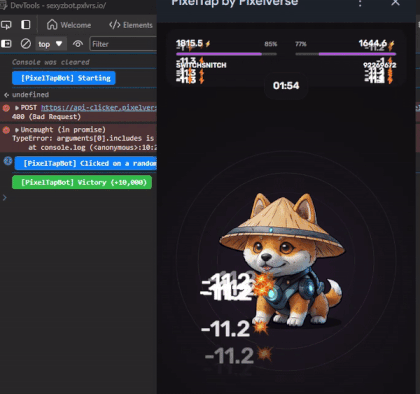

> [!NOTE]
> - Контакты: [Telegram](https://t.me/mudachyo) 
> - Канал: [Telegram Channel](https://t.me/shopalenka) 
> - 🇪🇳 README in english available [here](README-EN.md)



---
# Как запустить
# [Посмотреть видео инструкцию](https://www.youtube.com/watch?v=FgyCcPZBmtc)
### Telegram Desktop на Windows, Linux and macOS
1. Загрузите и запустите последнюю версию Telegram Desktop на Windows, Linux или macOS.
2. Откройте «Настройки» > «Продвинутые настройки» > «Экспериментальные настройки» > «Enable webview inspection».
3. Откройте [PixelTap](tg://resolve?domain=pixelversexyzbot&start=2475526)
4. Нажмите правой кнопкой мыши в любом месте игры и выберите последний пункт «Проверить»
5. Откройте "Консоль", вставьте туда код и начните бой. (Если вставка запрещена - https://stackoverflow.com/a/78472510)

### Telegram macOS
1. Скачайте и запустите [Telegram Beta](https://telegram.org/dl/macos/beta) для macOS.
2. Быстро нажмите 5 раз на значок «Настройки», чтобы открыть меню отладки и включить «Отладку мини-приложений».

### Сам скрипт:
```javascript
const styles = {
    success: 'background: #28a745; color: #ffffff; font-weight: bold; padding: 4px 8px; border-radius: 4px;',
    starting: 'background: #8640ff; color: #ffffff; font-weight: bold; padding: 4px 8px; border-radius: 4px;',
    error: 'background: #dc3545; color: #ffffff; font-weight: bold; padding: 4px 8px; border-radius: 4px;',
    info: 'background: #007bff; color: #ffffff; font-weight: bold; padding: 4px 8px; border-radius: 4px;'
};
const logPrefix = '%c[PixelTapBot] ';

const originalLog = console.log;
console.log = function () {
    if (typeof arguments[0] === 'string' && arguments[0].includes('[PixelTapBot]')) {
        originalLog.apply(console, arguments);
    }
};

console.error = console.warn = console.info = console.debug = () => { };

console.clear();
console.log(`${logPrefix}Starting`, styles.starting);
console.log(`${logPrefix}Create by t.me/mudachyo`, styles.starting);

function createEvent(type, target, options) {
    const event = new PointerEvent(type, {
        bubbles: true,
        cancelable: true,
        view: window,
        detail: 1,
        pointerId: 1,
        width: 1,
        height: 1,
        tangentialPressure: 0,
        tiltX: 0,
        tiltY: 0,
        pointerType: 'touch',
        isPrimary: true,
        ...options
    });
    target.dispatchEvent(event);
}

function getCoords(element) {
    const rect = element.getBoundingClientRect();
    const x = rect.left + rect.width / 2;
    const y = rect.top + rect.height / 2;
    return {
        clientX: x,
        clientY: y,
        screenX: window.screenX + x,
        screenY: window.screenY + y
    };
}

const randomDelay = (min, max) => Math.floor(Math.random() * (max - min + 1)) + min;
const randomOffset = range => Math.floor(Math.random() * (2 * range + 1)) - range;
const randomPressure = () => Math.random() * 0.5 + 0.5;

function clickElement(target) {
    const { clientX, clientY, screenX, screenY } = getCoords(target);
    const options = {
        clientX: clientX + randomOffset(10),
        clientY: clientY + randomOffset(10),
        screenX: screenX + randomOffset(10),
        screenY: screenY + randomOffset(10),
        pressure: randomPressure()
    };
    ['pointerdown', 'mousedown', 'pointerup', 'mouseup', 'click'].forEach(type => createEvent(type, target, options));
}

function clickRandomCard() {
    const cards = document.querySelectorAll('._card_1ymyk_1:not(._active_1ymyk_21)');
    if (cards.length) {
        clickElement(cards[Math.floor(Math.random() * cards.length)]);
    }
}

let wins = 0;
let losses = 0;
let totalPoints = 0;

function handleEndGame() {
    const endGameElement = document.querySelector('#root > div > div > div:nth-child(1) > div > div > h3');
    if (endGameElement) {
        const restartBtn = document.querySelector('#root button._button_fe4eh_1._purple_fe4eh_31._textUppercase_fe4eh_28');
        const gameResult = document.querySelector('#root > div > div > div:nth-child(1) > div > div > div._footerCard_bgfdy_87 > div._reward_bgfdy_17 > span').innerText;
        const points = parseInt(gameResult.replace(/[^0-9]/g, ''), 10);

        if (gameResult.includes('-')) {
            losses++;
            totalPoints -= points;
        } else {
            wins++;
            totalPoints += points;
        }

        console.log(`${logPrefix}${gameResult.includes('-') ? 'Defeat' : 'Victory'} (${gameResult})`, gameResult.includes('-') ? styles.error : styles.success);
        console.log(`${logPrefix}Stats: Wins: ${wins} | Losses: ${losses} | Total Points: ${totalPoints}`, styles.info);
        restartBtn.click();
    }
}

let isGamePaused = false;

function toggleGamePause() {
    isGamePaused = !isGamePaused;
    pauseButton.textContent = isGamePaused ? 'Resume' : 'Pause';
}

function autoClick() {
    if (!isGamePaused) {
        try {
            const targetArea = document.querySelector('.clickableArea');
            if (targetArea) {
                clickElement(targetArea);
                if (window.Telegram?.WebView?.postEvent) {
                    Telegram.WebView.postEvent('web_app_trigger_haptic_feedback', { type: 'impact', impact_style: 'medium' });
                }
            } else {
                handleEndGame();
            }
            if (!document.querySelectorAll('._card_1ymyk_1._active_1ymyk_21').length) {
                clickRandomCard();
            }
        } catch (error) {
            // Do not log the error to avoid cluttering the console
        }
    }
    setTimeout(autoClick, randomDelay(20, 110));
}

const pauseButton = document.createElement('button');
pauseButton.textContent = 'Pause';
Object.assign(pauseButton.style, {
    position: 'fixed',
    bottom: '20px',
    right: '20px',
    zIndex: '9999',
    padding: '4px 8px',
    backgroundColor: '#5d5abd',
    color: 'white',
    border: 'none',
    borderRadius: '10px',
    cursor: 'pointer'
});
pauseButton.onclick = toggleGamePause;
document.body.appendChild(pauseButton);

autoClick();
```

---
> [!TIP]
> Другие репозитории:
> 
> - [Hamster Kombat + Autoclicker](https://github.com/mudachyo/Hamster-Kombat)
> 
> - [TapSwap + Autoclicker](https://github.com/mudachyo/TapSwap)
> 
> - [Blum + Autoclicker](https://github.com/mudachyo/Blum)
>
> - [PixelTap + Autoclicker](https://github.com/mudachyo/PixelTap)
> 
> - [MemeFi + Autoclicker](https://github.com/mudachyo/MemeFi-Coin)
---
> [!IMPORTANT] 
> Donation
> 
> We accept the following cryptocurrencies:
> 
> - **TON**: `UQCGUzPN5GnFqWJiYsFtqqLGO75-cBXlOL8f_qbd7yKY2Tzh`
> 
> - **USDT**(TRC20): `TFr8CiAPqEnSyoXHtVefWumodcXgjoB8rS`
> 
> - **USDT**(TON): `UQCGUzPN5GnFqWJiYsFtqqLGO75-cBXlOL8f_qbd7yKY2Tzh`
> 
> - **NOTCOIN**(TON): `UQCGUzPN5GnFqWJiYsFtqqLGO75-cBXlOL8f_qbd7yKY2Tzh`
> 
> - **BTC**: `1Mba8xKKVLdcFJdV7jD8Ba3fFn7DWbp4bt`
> 
> Donations will be used to maintain the project.