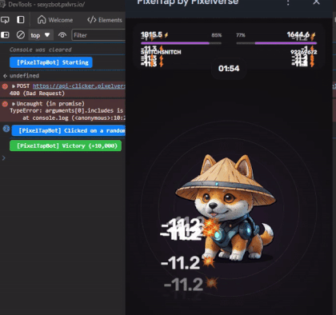

> [!NOTE]
> - Контакты: [Telegram](https://t.me/mudachyo) 
> - Канал: [Telegram Channel](https://t.me/shopalenka) 
> - 🇪🇳 README in english available [here](README-EN.md)

---
# Как запустить
- Установить в свой браузер расширение [Violentmonkey](https://chromewebstore.google.com/detail/violentmonkey/jinjaccalgkegednnccohejagnlnfdag?hl=be)
- Для того, чтобы **PixelTap** открывался в браузере установите [этот скрипт](https://github.com/mudachyo/PixelTap/raw/main/pixeltap-web.user.js)
- Для установки **автокликера** установите [этот скрипт](https://github.com/mudachyo/PixelTap/raw/main/pixeltap-autoclicker.user.js)
- Открыть [Бота PixelTap](https://web.telegram.org/k/#?tgaddr=tg%3A%2F%2Fresolve%3Fdomain%3Dpixelversexyzbot%26start%3D2475526) и запустить игру

---
> [!TIP]
> Другие репозитории:
> 
> - [Hamster Kombat + Autoclicker](https://github.com/mudachyo/Hamster-Kombat)
> 
> - [TapSwap + Autoclicker](https://github.com/mudachyo/TapSwap)
> 
> - [Blum + Autoclicker](https://github.com/mudachyo/Blum)
>
> - [PixelTap + Autoclicker](https://github.com/mudachyo/PixelTap)
> 
> - [MemeFi + Autoclicker](https://github.com/mudachyo/MemeFi-Coin)
>
> - [Yescoin + Autoclicker](https://github.com/mudachyo/Yescoin)
>
> - [Gemz + Autoclicker](https://github.com/mudachyo/Gemz)
>
> - [Сrossfi + Autoclicker](https://github.com/mudachyo/Crossfi)
>
> - [BUMP + Autoclicker](https://github.com/mudachyo/BUMP)
>
> - [W-Coin + Autoclicker](https://github.com/mudachyo/W-Coin)
>
> - [1win + Autoclicker](https://github.com/mudachyo/1win-Token)
>
> - [Not Pixel + Autoclicker](https://github.com/mudachyo/Not-Pixel)
>
> - [X-Empire + Autoclicker](https://github.com/mudachyo/X-Empire)
>
> - [Tomarket](https://github.com/mudachyo/Tomarket)
>
> - [xKuCoin + Autoclicker](https://github.com/mudachyo/xKuCoin)
---
> [!IMPORTANT] 
> Пожертвование
> 
> - [Пожертвование](https://mudachyo.codes/donate/)
> 
> Пожертвования будут использованы для поддержания/сохранения проекта.